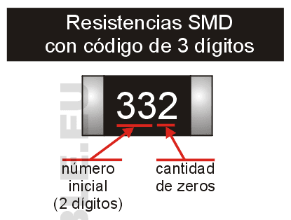

# Como se leen las resistencias SMD

En este artículo describo como se leen los valores de las resistencias SMD (montaje superficial) en todas sus versiones, es decir, con códigos numéricos de 3 cifras, de 4 cifras y también de tipo alfanumérico (EIA-96). También mostraré las dimensiones estándar y las potencias que pueden disipar.

## Códigos de tres cifras

Las resistencias más fáciles de leer son las que tienen códigos numéricos de 3 cifras. En ellas, los dos primeros dígitos son el valor numérico mientras que el tercer dígito es el multiplicador, es decir, la cantidad de ceros que debemos agregar al valor. Es un sistema similar al que se usa con los capacitores y que explico en mi artículo "Como se leen los valores de los capacitores".

Veamos un ejemplo: una resistencia con el número 472 es de 4.700 ohms o (4,7K) porque al número "47" (los dos primeros dígitos) debemos agregar 2 ceros (el número "2" del tercer dígito). En la figura siguiente les muestro gráficamente el sistema con algunos ejemplos de valores comunes.