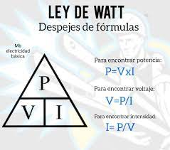

# POTENCIA ELECTRICA

    - Es el trabajo efectuado al desplazar las cargas electricas en un tiempo determinado, 
    
    - Su unidad de medida es Watts (W)
    
    - Se representa con la letra (P o W)

## LEY DE WATT

    - En un circuito electrico la potencia electrica es directamente proporcional al voltaje y la corriente

        Formula

        P = V X I

        Potencia = Voltaje x Corriente

## EXERCISES

    - 1 Averiguar cuanta corriente consume un bombillo de 100 Watts en una casa con 110V

        Answer: 
        
        I = P / V

        100 / 110 = 0.9090

    - 2 Un circuito tiene un voltaje de 12v y la corriente que circula por la carga es de 2 amperios. Cual es la potencia entregada por la fuente de voltaje y absorbida por la carga?

        Answer: 
        
        P = V x I

        12 x 2 = 24Watts