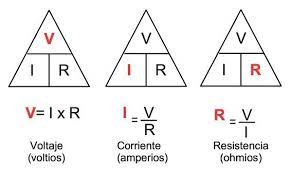

# LEY DE OHM

    - Es una expresion matematica que relaciona el voltaje, La Corriente y la ressitencia.

    - La corriente que circula por un circuito electrico es directamente proporcional al voltaje, e inversamente proporcional a la resistencia del circuito.

    - Formula

        I = V
            R

## EXERCISES

    - 1 Un circuito tiene una resistencia de 6 Ohmios y la corriente es de 2 Amperios. Cual es el voltaje de la fuente?

        Answer:
        
            V = I x R

            6 x 2 = 12V

